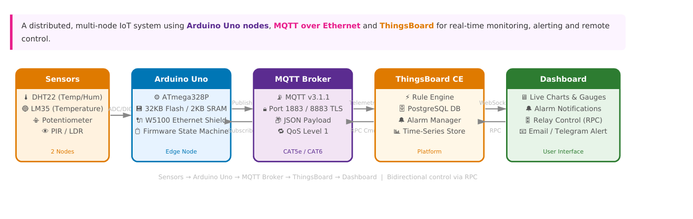
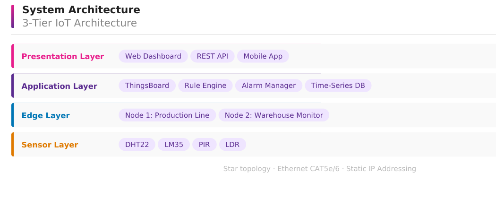
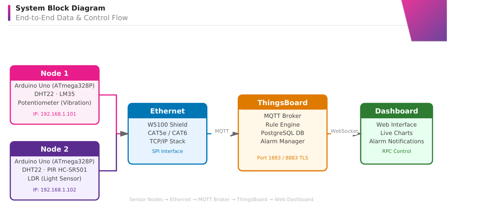
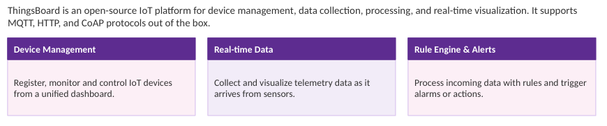
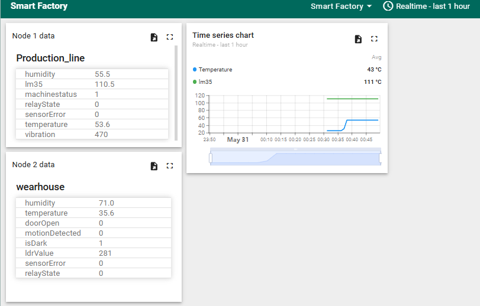
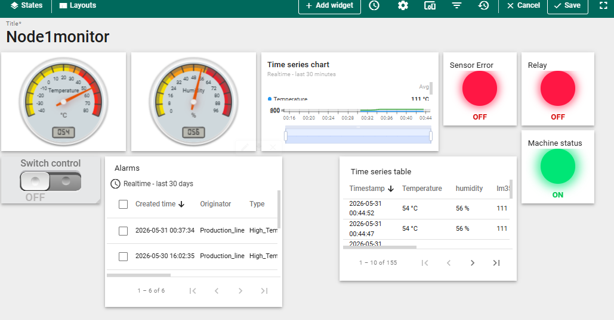
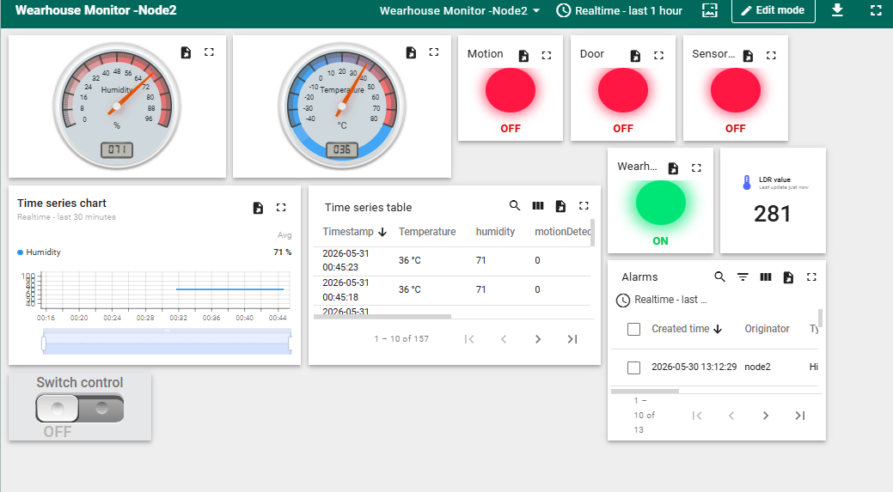
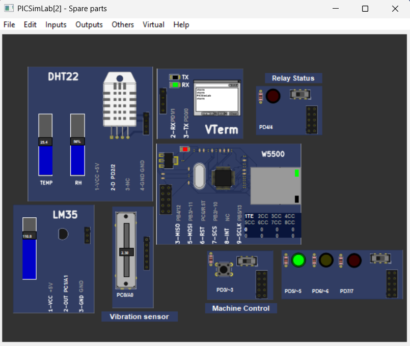
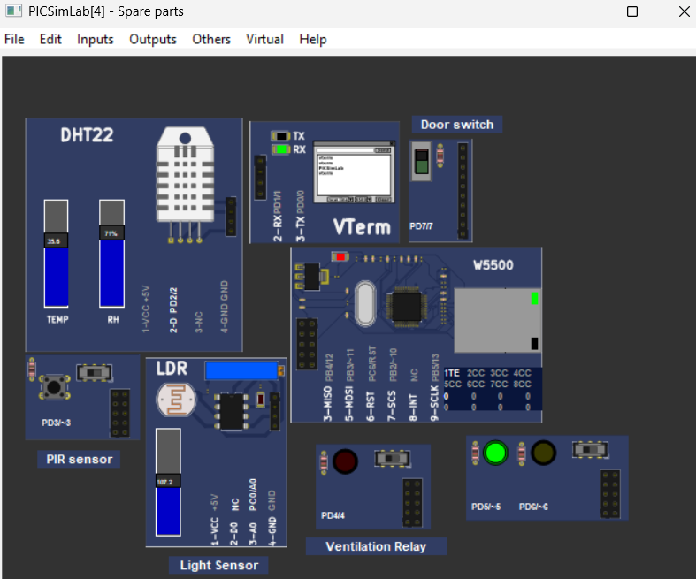

# Smart Factory Monitoring System

An IoT-based Smart Factory Monitoring System built using Arduino, MQTT, ThingsBoard, Ethernet communication, and PICSimLab simulation.
The system monitors industrial and warehouse environments in real time, publishes telemetry data to the cloud, supports remote RPC control, and performs automated environmental actions.

---

# Project Overview

#  Distributed IoT Monitoring - Proposed solution

```text
Sensors → Arduino UNO → Ethernet Shield → MQTT → ThingsBoard Cloud Dashboard
```


Both nodes communicate independently with ThingsBoard using MQTT protocol.

---


## This project simulates a smart factory consisting of two independent monitoring nodes:
## Node 1 — Production Line Monitoring

Monitors:

* Temperature
* Humidity
* Machine vibration
* Machine operational status

Features:

* Real-time telemetry publishing
* Remote relay control using ThingsBoard RPC
* Sensor fault detection
* Status indication LEDs
* MQTT communication using Ethernet

---

## Node 2 — Warehouse Monitoring

Monitors:

* Temperature
* Humidity
* Motion detection
* Door status
* Light intensity (LDR)

Features:

* Automatic ventilation control during critical humidity
* Remote relay control through dashboard
* PIR-based motion monitoring
* Warehouse darkness detection
* Real-time telemetry publishing

---

# System Architecture

```text
3-Tier IoT Architecture
```



---

# System Block Diagram

```text
End-to-End Data & Control Flow
```



---
# Technologies Used

* Arduino UNO
* Embedded C++
* MQTT Protocol
* ThingsBoard Cloud
* Ethernet Shield (W5100)
* PICSimLab
* DHT22 Sensor
* LM35 Temperature Sensor
* PIR Motion Sensor
* LDR Sensor
* Relay Module
* LEDs
* PubSubClient Library

---

# Features

## Real-Time Monitoring

* Continuous telemetry publishing every 5 seconds
* Cloud dashboard visualization

## MQTT Communication

* Secure communication with ThingsBoard
* Automatic reconnection handling

## RPC Remote Control

* Remote relay switching from dashboard
* MQTT-based command execution

## Smart Automation

* Automatic warehouse ventilation when humidity exceeds critical threshold

## Fault Detection

* DHT22 sensor failure handling
* Status LED indications

## Hardware Simulation

* Fully tested using PICSimLab virtual environment

---

# Folder Structure

```text
Smart-Factory-Monitoring-System/
│
├── Node1_Production/
│   └── node1/
│
├── Node2_Warehouse/
│   └── node2/
│
├── screenshots/
│
└── README.md
```

---

# Node 1 Sensors & Actuators

## Sensors
* DHT22(Temp/Humidity)
* LM35(Temp)
* Vibration Sensor(used potentiometer)


## Actuators

* Relay
* Green LED
* Yellow LED
* Red LED
* Push Button

---

# Node 2 Sensors & Actuators

## Sensors

* DHT22(Temp/Humidity)
* PIR Motion Sensor
* LDR(Light Sensor)
* Door Sensor(used a switch)

## Actuators

* Ventilation Relay
* Green LED
* Yellow LED
* Red LED

---

# LED Status Indication

## Green LED

* System operating normally

## Yellow LED

* Sensor warning/error condition

## Red LED

* MQTT/Network disconnected

---
## Project Requirements
#### Functional Requirements
* Real-time	sensor	data	collection	every	5	seconds
* Automated	threshold-based	alerting	(temperature,	vibration,	humidity)
* Remote	relay	/	actuator	control	via	ThingsBoard	dashboard
* Historical	trend	analysis	and	data	reporting
* Multi-node	coordination	for	emergency	scenarios
* MQTT	telemetry	publishing	with	JSON	payload	format

#### Non-Functional & Simulator Requirements
#### Non-Functional
* End-to-end	latency	<	5	seconds
* System	uptime	>	99%
* Scalable	to	100+	nodes
* MQTT	message	size	≤	256	bytes
* Dashboard	load	time	<	3	seconds
#### Simulator	(PICSimLab)
* PICSimLab	for	Arduino	Uno	simulation
* Virtual	sensors:	DHT22,	LM35,	PIR,	LDR
* Simulated	Ethernet	(W5100)	connectivity
* No	physical	hardware	required
* Supports	full	firmware	testing	&	MQTT


---

# ThingsBoard Integration



The project uses:

* MQTT Telemetry API
* MQTT RPC API
* Dashboard widgets
* Alarm monitoring

Dashboard capabilities:

* Live sensor monitoring
* Relay switching
* Alarm visualization
* Device connectivity tracking

---

# PICSimLab Simulation

The project was simulated using PICSimLab for:

* Sensor simulation
* Relay simulation
* LED visualization
* Real-time hardware testing

---

# Key Learnings

This project helped in understanding:

* Embedded systems programming
* MQTT communication
* IoT cloud integration
* RPC handling
* Real-time telemetry systems
* Sensor interfacing
* Automation logic
* Modular firmware architecture

---

# Future Improvements

* Add ESP32/WiFi support
* Add database logging
* Mobile app integration
* Predictive maintenance using AI/ML
* SMS/Email alert system
* Multi-node scalability

---

# Screenshots

## ThingsBoard Dashboard

#### Smart-Factory-dashboard


#### Node1 


#### Node2 connection



## PICSimLab Simulation

#### Node1 connection


#### Node2 connection


---


## Requirements

* Arduino IDE
* PICSimLab
* ThingsBoard account
* Required Arduino libraries

## Libraries

Install:

* PubSubClient
* Ethernet
* DHT Sensor Library
* Adafruit Unified Sensor
* SPI Library

---

# Configuration

Update `config.h`:

```cpp
#define ACCESS_TOKEN "YOUR_DEVICE_TOKEN"
```

Replace with your ThingsBoard device token.

---

# Author

Developed by Adithyan Anilkumar

Passionate about:
* Industrial IoT 
* Embedded Systems
* AI & Machine Learning
Linkedin Profle:https://www.linkedin.com/in/adithyan-anilkumar-a23129329/
---

# License

This project is developed for educational and learning purposes.
